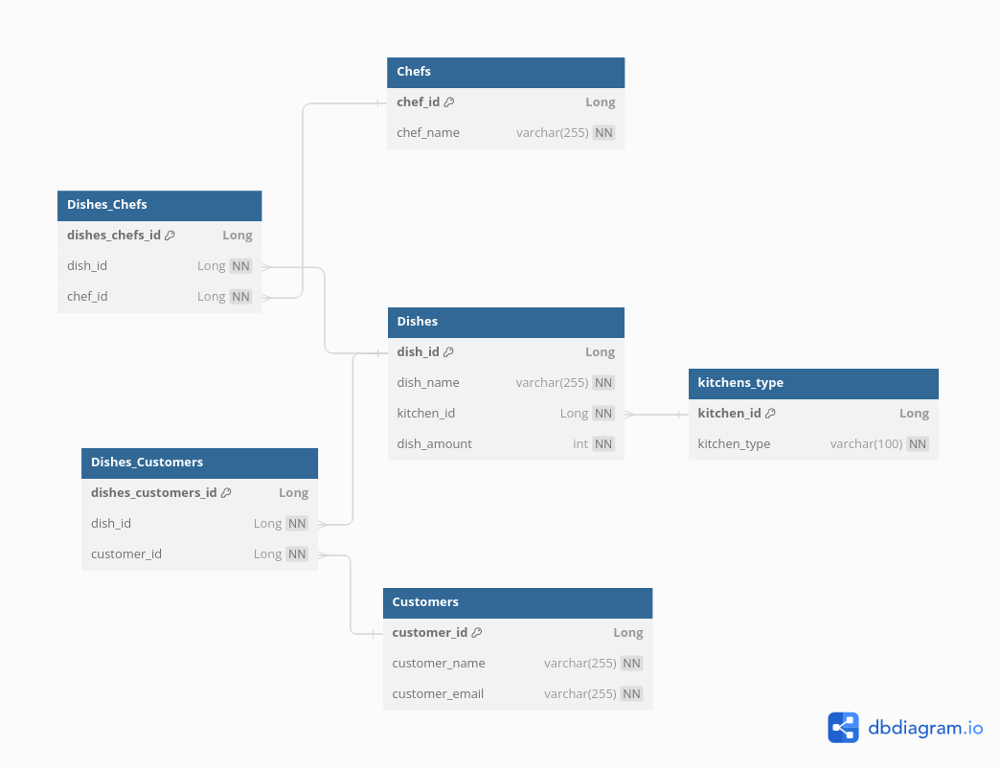

# README - Diagrama de Base de Datos


### Conusltas

1. **Consulta para obtener platos de un chef específico:**
   ```sql
   select Dishes.dish_name, Dishes.dish_amount 
   from Dishes 
   join Dishes_Chefs on Dishes.dish_id = Dishes_Chefs.dish_id 
   join Chefs on Dishes_Chefs.chef_id = Chefs.chef_id 
   where Chefs.chef_name = 'Nombre del chef';


2. **Consulta obtimizada:**
   ```sql
    create view chef_dishes as 
    select Dishes.dish_name, Dishes.dish_amount, Chefs.chef_name 
    from Dishes 
    join Dishes_Chefs on Dishes.dish_id = Dishes_Chefs.dish_id 
    join Chefs on Dishes_Chefs.chef_id = Chefs.chef_id;
    
    select * from chef_dishes 
    where chef_name = 'Nombre del chef';

### Código del diagrama
es posible visualizarlo en: https://dbdiagram.io
    ```plaintext
    Table Dishes {
    dish_id Long [pk, increment]
    dish_name varchar(255) [unique, not null]
    kitchen_id Long [not null, ref: > kitchens_type.kitchen_id, note: 'Kitchen_types: Al vapor, Al horno, Asado, etc']
    dish_amount int [not null]
    }

    Table kitchens_type {
    kitchen_id Long [pk, increment]
    kitchen_type varchar(100) [unique, not null]
    }

    Table Chefs {
    chef_id Long [pk, increment]
    chef_name varchar(255) [unique, not null]
    }

    Table Dishes_Chefs {
    dishes_chefs_id Long [pk, increment]
    dish_id Long [not null, ref: > Dishes.dish_id]
    chef_id Long [not null, ref: > Chefs.chef_id]
    }

    Table Customers {
    customer_id Long [pk, increment]
    customer_name varchar(255) [unique, not null]
    customer_email varchar(255) [unique, not null]
    }

    Table Dishes_Customers {
    dishes_customers_id Long [pk, increment]
    dish_id Long [not null, ref: > Dishes.dish_id]
    customer_id Long [not null, ref: > Customers.customer_id]
    }